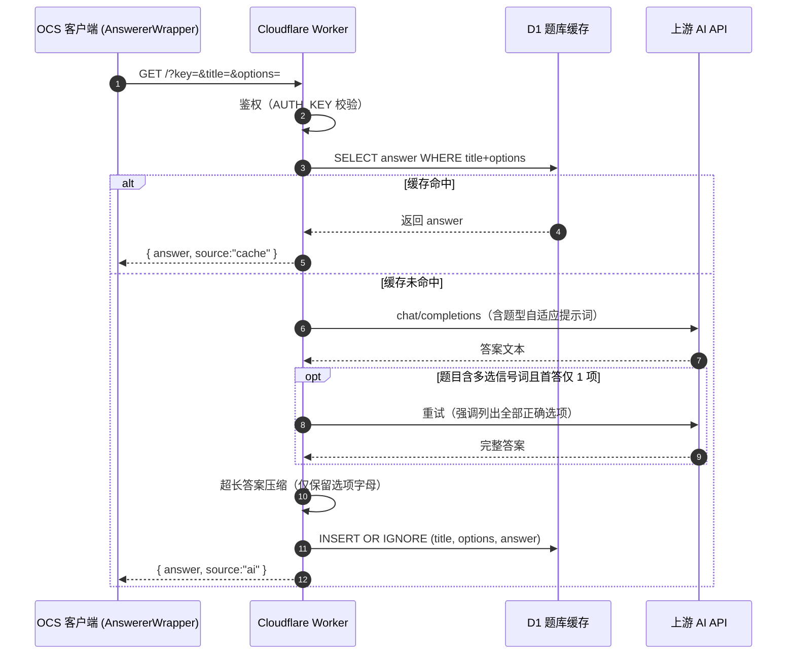

# OCS Answer Bridge

一个部署在 [Cloudflare Workers](https://workers.cloudflare.com/) 上的 OCS（Open College Study，[ocsjs/ocsjs](https://github.com/ocsjs/ocsjs)）网课答题代理。它在 OCS 客户端与任意 OpenAI 兼容的 AI API 之间充当中转层，并配套 D1 题库缓存、题型自适应格式化与网页端请求调试模板。

> **核心功能来源声明**：本项目的核心中转思路（将 OCS `AnswererWrapper` 的 GET 请求转发到 OpenAI Chat Completions 兼容 API）源自 **[uucz/ocs-ai-proxy](https://github.com/uucz/ocs-ai-proxy/blob/main/README.md)**。本仓库在其基础上进行了以下增强：
>
> - 引入 **Cloudflare D1** 作为持久化题库缓存，命中缓存直接返回，避免对相同题目重复消耗 API 额度；
> - **题型自适应格式化**：单选题给出选项与内容、多选题强制列出全部正确选项、判断题仅答「正确/错误」、论述题不分 A/B/C/D 点；
> - **多选题完整性兜底**：当题目含多选信号词但首答仅返回一个选项时，自动以强调指令重试一次；
> - 选择题答案超长时自动压缩为选项字母，适配 OCS 端显示；
> - 提供 **网页端请求模板**（`request-template.html`），无需后端即可手动构造请求、查看缓存命中状态、健康检查与缓存统计。

## 特性

- 兼容任意 OpenAI Chat Completions 格式的服务（OpenAI / DeepSeek / Moonshot / 硅基流动 / 小米 `mimo` 等），仅需修改 `API_BASE`；
- D1 缓存闭环（查询 → 未命中调模型 → 写回），重复题目零额度消耗；
- 跨域友好：响应携带 `Access-Control-Allow-Origin: *`，前端可直接 `fetch` 调用；
- 轻量：单文件 `worker.js`，无构建步骤；
- 附带 `/health` 健康检查与 `/stats` 缓存统计端点。

## 工作原理

```
OCS 客户端 (AnswererWrapper)
   │  GET /?key=...&title=...&options=...
   ▼
Cloudflare Worker (worker.js)
   ├─ 鉴权 (AUTH_KEY)
   ├─ 查 D1 缓存 (title + options 唯一键)
   │     ├─ 命中 → 直接返回 answer, source:"cache"
   │     └─ 未命中 → 调用 AI API
   │            ├─ 多选兜底重试（如需）
   │            ├─ 答案格式化 / 超长压缩
   │            └─ 写回 D1 → 返回 answer, source:"ai"
   ▼
OCS 客户端解析 res.answer
```

请求时序图（缓存命中 / 未命中两条分支）：



> 说明：缓存命中分支完全不调用上游 AI，因此对同一题目的重复请求零额度消耗；只有未命中时才会消耗一次 `AI API` 调用并写回 D1。

## 目录结构

```
ocs-answer-bridge/
├── worker.js            # Cloudflare Worker 主程序（核心逻辑）
├── wrangler.toml        # Wrangler 部署配置（含 D1 绑定与明文变量）
├── schema.sql           # D1 建表语句（缓存按 title+options 唯一）
├── migrations/001_cache_version.sql # 存量库迁移：确保 answers 含 cache_version 列与正确唯一约束（幂等）
├── deploy.ps1           # 一键部署脚本（PowerShell，需 Windows + wrangler）
├── request-template.html# 网页端请求调试模板（浏览器直接打开）
├── ocs-config.json      # OCS 客户端 AnswererWrapper 配置示例
├── LICENSE               # MIT 许可（衍生自 uucz/ocs-ai-proxy）
├── .gitignore
└── README.md
```

## 环境变量

| 变量名 | 说明 | 是否加密 | 默认值 |
|--------|------|----------|--------|
| `API_KEY` | 上游 AI 服务的 API Key | ✅ 必须加密（`wrangler secret put`） | — |
| `API_BASE` | API 基础地址 | 否（`[vars]`） | `https://api.siliconflow.cn` |
| `MODEL` | 模型名称 | 否（`[vars]`） | `deepseek-ai/DeepSeek-V3` |
| `AUTH_KEY` | 访问鉴权 Key（OCS 配置中作为参数传入） | ✅ 建议加密 | — |
| `SYSTEM_PROMPT` | 系统提示词（控制答题格式） | 否 | 内置题型自适应提示词 |
| `DB` | D1 数据库绑定（由 `wrangler.toml` 声明） | — | — |

> **运维端点（均受 `AUTH_KEY` 保护，需带正确 `key` 访问）**：
> - `GET /admin/clear?title=<题目>&options=<选项>` — 失效单条缓存（该题目下次请求将重新生成）；
> - `GET /admin/clear-all` — 清空全部缓存（谨慎使用）。

## ⚠️ 部署前提：自定义域名与大陆访问

本项目以 Cloudflare Workers 为载体，**必须由你自己提供一个已托管在 Cloudflare 的自定义域名**才能稳定对外提供服务：

1. **Cloudflare 托管域名是前提**：Worker 默认分配的 `*.workers.dev` 子域名仅作开发调试用途。生产环境（尤其是 OCS 客户端长期调用）需将自有域名的 DNS（NS）托管到 Cloudflare，再通过 **Custom Domain** 或 **Worker Routes** 绑定到本 Worker。
2. **大陆无法直连默认域名**：`*.workers.dev` 在中国大陆网络环境下通常不可直连。只有绑定到托管在 Cloudflare 的自定义域名（如 `<YOUR_DOMAIN>`），才能在中国大陆正常访问。
3. **绑定步骤**：Cloudflare Dashboard → 你的域名 → Workers Routes / Custom Domains → 添加路由（如 `https://<YOUR_DOMAIN>/*`）指向本 Worker；或在 `wrangler.toml` 中配置 `routes` 后执行 `wrangler deploy`。

> 部署完成后，将 OCS 客户端配置中的 `Base URL` 填写为该自定义域名（见下方「OCS 客户端配置」中的 `<YOUR_DOMAIN>` 占位符）。

## 快速开始

满足「部署前提」后，约 5 分钟即可跑通：

```bash
# 1. 克隆并进入仓库
git clone https://github.com/poying2018/ocs-answer-bridge.git
cd ocs-answer-bridge

# 2. 安装 wrangler 并登录
npm install -g wrangler && wrangler login

# 3. 创建 D1 数据库，把返回的 database_id 填入 wrangler.toml 的 database_id
wrangler d1 create ocs

# 4. 初始化表（全新库）
wrangler d1 execute ocs --remote --file=schema.sql
# 4b. 确保表含 cache_version 列且唯一约束正确（存量库幂等迁移，可重复执行）
wrangler d1 execute ocs --remote --file=migrations/001_cache_version.sql

# 5. 设置密钥与变量
wrangler secret put API_KEY      # 上游 AI Key
wrangler secret put AUTH_KEY     # 访问鉴权 Key（OCS 客户端传入）
wrangler deploy                  # 部署（MODEL/API_BASE 已固化在 [vars]）

# 6. 把 OCS 客户端的 Base URL 填为你的 Cloudflare 自定义域名，即可使用
```

不想用命令行？直接看下方「方式二 / 方式三」或使用 `deploy.ps1`（Windows）。

## 部署

### 方式一：Wrangler CLI

```bash
# 1. 安装 wrangler 并登录
npm install -g wrangler
wrangler login

# 2. 创建 D1 数据库，并将返回的 database_id 填入 wrangler.toml
wrangler d1 create ocs

# 3. 初始化表 + 升级缓存版本机制
wrangler d1 execute ocs --remote --file=schema.sql
wrangler d1 execute ocs --remote --file=migrations/001_cache_version.sql

# 4. 设置加密变量
wrangler secret put API_KEY
wrangler secret put AUTH_KEY

# 5. 部署
wrangler deploy
```

### 方式二：一键部署脚本（Windows PowerShell）

```powershell
.\deploy.ps1 -CFToken "你的Cloudflare_API_Token" -ApiKey "你的AI_API_Key" -AuthKey "你的AUTH_KEY"
```

> `deploy.ps1` 中的 `ApiKey` / `AuthKey` 默认值仅为占位符，请通过参数显式传入真实值，切勿将真实密钥提交到仓库。

### 方式三：Cloudflare Dashboard

将 `worker.js` 内容粘贴进 Worker 编辑器，并在 Settings → Variables 中配置上述环境变量与 D1 绑定。

## OCS 客户端配置

将以下 JSON 填入 OCS 题库设置（AnswererWrapper）。将 `<YOUR_DOMAIN>` 与 `<YOUR_AUTH_KEY>` 替换为你的值：

```json
[
  {
    "name": "AI 答题",
    "url": "https://<YOUR_DOMAIN>/?key=<YOUR_AUTH_KEY>&title=${title}&options=${options}",
    "method": "get",
    "type": "fetch",
    "handler": "return (res)=> res.answer ? [undefined, res.answer] : undefined"
  }
]
```

也可直接复制 `ocs-config.json` 使用。

## 缓存管理

D1 缓存命中即对相同题目零额度消耗。**缓存与模型/提示词解耦**：答案按 `(title, options)` 命中，与当前所用模型、`SYSTEM_PROMPT` 无关——因此更换模型或调整提示词**不会**清空缓存，已缓存的题目答案会照常复用。

若某题缓存了错误/不完整答案（如早期多选题不全），用以下方式让其重新生成：

1. **单条失效**（推荐，精准）：调用受 `AUTH_KEY` 保护的运维端点，只让这一题下次请求回源 AI：
   ```
   GET https://<YOUR_DOMAIN>/admin/clear?key=<YOUR_AUTH_KEY>&title=<题目>&options=<选项>
   ```
2. **全量清空**（谨慎）：清空整张缓存表，所有题目下次请求都会重新生成：
   ```
   GET https://<YOUR_DOMAIN>/admin/clear-all?key=<YOUR_AUTH_KEY>
   ```

> 运维端点返回 JSON，例如 `{ "ok": true, "cleared": { "title": "...", "options": "..." }, "changes": 1 }`。`changes` 为实际删除行数。

## 预置题库（可选）

本仓库附带 `seed_chaoxing.sql`，内含一批预置答案（超星题库格式，368 题，均为 `INSERT OR IGNORE`）。执行后相同题目将直接命中缓存、不再回源 AI，适合作为冷启动数据。

```bash
# 灌入线上 D1（注意：D1 不支持 SQL 文件内的 BEGIN/COMMIT，本文件已省略）
wrangler d1 execute ocs --remote --file=seed_chaoxing.sql
```

> 说明：
> - `options` 已格式化为 `A. 文本 B. 文本 …`（与 Worker `SYSTEM_PROMPT` 约定一致），可正常命中缓存。
> - 答案被截断（含 `…`）的题已剔除，由 AI 首次遇到时自动补全并回填缓存。
> - 该文件含题库答案内容，推送到公开仓库即对外可见；若不想泄露可移出仓库或改用私有仓。

## 网页端请求模板

浏览器直接打开 `request-template.html`：

- 填写 **API 地址** 与 **鉴权 Key**（对应 Worker 的 `API_BASE` 域名与 `AUTH_KEY`）；
- 输入 **题目** 与（可选）**选项**，实时生成可复制的请求 URL；
- 点击「发送请求」查看答案与 `source` 徽章（命中缓存 / 模型生成）；
- 「健康检查」「缓存统计」按钮用于快速排查。

## 请求参数

Worker 接受以下 GET 参数：

| 参数 | 说明 |
|------|------|
| `key` | 鉴权 Key，需与 `AUTH_KEY` 一致（未配置 `AUTH_KEY` 时留空放行） |
| `title` | 题目内容（必填） |
| `options` | 选项内容，换行分隔（选填；留空即纯问答） |

返回 `application/json`：`{ "answer": "...", "source": "cache" | "ai" }`。

## 常见问题 / 故障排查

| 现象 | 可能原因 | 处理 |
|------|----------|------|
| 返回 `401 { "error": "unauthorized" }` | 请求的 `key` 与 `AUTH_KEY` 不一致 | 检查 OCS 客户端配置的 `key` 与 Worker 的 `AUTH_KEY` 是否相同 |
| 返回 `500 { "error": "API_KEY_NOT_SET" }` | 未配置 `API_KEY` | 执行 `wrangler secret put API_KEY` 或在 Dashboard 设置加密变量 |
| 返回 `500 { "error": "DB_NOT_BOUND" }` | D1 未绑定 | 检查 `wrangler.toml` 的 `d1_databases` 绑定与 Dashboard → Worker → Settings → Bindings |
| 上游返回 `401` / `402` | `API_KEY` 无效或额度不足 | 在 AI 服务商后台核对 Key 与余额 |
| `/health` 显示 `db: "NOT_BOUND"` | 同上（D1 未绑定） | 同上 |
| 大陆访问超时 / 无法连接 | 使用了默认 `*.workers.dev` 域名 | 必须将 Worker 绑定到托管在 Cloudflare 的自定义域名（见「部署前提」） |
| 缓存一直返回旧的错误答案 | 旧答案已固化 | 用 `/admin/clear` 单条失效让该题重新生成（见「缓存管理」）；必要时用 `/admin/clear-all` 全量清空 |
| OCS 客户端无响应 / 跨域报错 | 浏览器端调用被 CORS 拦截（正常不会） | Worker 已返回 `Access-Control-Allow-Origin: *`；检查 `Base URL` 是否写错导致请求未到达 Worker |

> 调试技巧：先用 `request-template.html` 或 `curl` 直接请求 `https://<YOUR_DOMAIN>/health` 与 `/stats`，确认 Worker 与 D1 状态，再排查答题链路。

## worker.js

> 仓库根目录 `worker.js` 的完整内容。点击下方折叠块展开，即可滚动阅读。
> 在线滚动阅读版（固定高度滚动窗）：**[poying2018.github.io/ocs-answer-bridge](https://poying2018.github.io/ocs-answer-bridge/)**

<details>
<summary>展开 / 收起 worker.js 完整源码</summary>

```js
// OCS Answer Bridge — Cloudflare Worker
// 功能：接收 OCS 答题请求 → 先查 D1 题库缓存 → 命中则返回，未命中则调用 AI 并写入缓存
// 部署：wrangler deploy（wrangler.toml 已声明 D1 绑定，部署时自动绑定）
// 缓存与模型解耦：答案按 (title, options) 命中，与所用模型/提示词无关；换模型不失效。纠正某题用 /admin/clear 单条失效。

// 选择题答案超长时，仅保留正确选项字母（如 "A、B、C"），避免 OCS 端显示过长。
// 仅当文本中出现「X. / X、/ X。」形式的选项字母时才压缩；论述题、判断题不含此类字母，不受影响。
const MAX_ANSWER_LEN = 200
function compressToLetters(text) {
  const letters = [...text.matchAll(/(?<![A-Za-z])([A-Z])(?=\s*[.、。])/g)].map(m => m[1])
  const seen = new Set()
  const uniq = []
  for (const l of letters) {
    if (!seen.has(l)) { seen.add(l); uniq.push(l) }
  }
  return uniq.length >= 1 ? uniq.join('、') : null
}

// 提取答案中作为选项出现的字母（A-D），用于多选题完整性校验
function extractOptionLetters(text) {
  if (!text) return []
  const letters = [...text.matchAll(/(?<![A-Za-z])([A-D])(?=[\s.、。,)）:]|$)/g)].map(m => m[1])
  const seen = new Set()
  const uniq = []
  for (const l of letters) {
    if (!seen.has(l)) { seen.add(l); uniq.push(l) }
  }
  return uniq
}

export default {
  async fetch(request, env) {
    const corsHeaders = {
      'Access-Control-Allow-Origin': '*',
      'Access-Control-Allow-Methods': 'GET, OPTIONS',
      'Access-Control-Allow-Headers': 'Content-Type',
    }

    // 预检
    if (request.method === 'OPTIONS') {
      return new Response(null, { headers: corsHeaders })
    }

    const url = new URL(request.url)

    // 健康检查（无需鉴权）
    if (url.pathname === '/health' || url.searchParams.get('health') === '1') {
      const dbOk = !!env.DB
      return new Response(JSON.stringify({ status: 'ok', db: dbOk ? 'bound' : 'NOT_BOUND' }), {
        headers: { ...corsHeaders, 'Content-Type': 'application/json' },
      })
    }

    // 缓存统计（无需鉴权）
    if (url.pathname === '/stats') {
      if (!env.DB) {
        return new Response(JSON.stringify({ error: 'DB not bound' }), {
          status: 500,
          headers: { ...corsHeaders, 'Content-Type': 'application/json' },
        })
      }
      try {
        const row = await env.DB.prepare('SELECT COUNT(*) AS total FROM answers').first()
        return new Response(JSON.stringify({ cached: row?.total ?? 0 }), {
          headers: { ...corsHeaders, 'Content-Type': 'application/json' },
        })
      } catch (e) {
        return new Response(JSON.stringify({ error: String(e) }), {
          status: 500,
          headers: { ...corsHeaders, 'Content-Type': 'application/json' },
        })
      }
    }

    const key = url.searchParams.get('key') || ''
    const title = (url.searchParams.get('title') || '').trim()
    const options = (url.searchParams.get('options') || '').trim()

    // 鉴权
    if (env.AUTH_KEY && key !== env.AUTH_KEY) {
      return new Response(JSON.stringify({ error: 'unauthorized' }), {
        status: 401,
        headers: { ...corsHeaders, 'Content-Type': 'application/json' },
      })
    }

    // 管理端点（同样受上方 AUTH_KEY 保护，必须带正确 key 才能访问）
    if (url.pathname.startsWith('/admin/')) {
      if (!env.DB) {
        return new Response(JSON.stringify({ error: 'DB not bound' }), {
          status: 500,
          headers: { ...corsHeaders, 'Content-Type': 'application/json' },
        })
      }
      // 全量清理缓存
      if (url.pathname === '/admin/clear-all') {
        try {
          const info = await env.DB.prepare('DELETE FROM answers').run()
          return new Response(JSON.stringify({ ok: true, cleared: 'all', changes: info?.meta?.changes ?? null }), {
            headers: { ...corsHeaders, 'Content-Type': 'application/json' },
          })
        } catch (e) {
          return new Response(JSON.stringify({ error: String(e) }), {
            status: 500,
            headers: { ...corsHeaders, 'Content-Type': 'application/json' },
          })
        }
      }
      // 单条清理：按 title + options 失效（options 可省略）
      if (url.pathname === '/admin/clear') {
        const t = (url.searchParams.get('title') || '').trim()
        const o = (url.searchParams.get('options') || '').trim()
        if (!t) {
          return new Response(JSON.stringify({ error: 'missing title' }), {
            status: 400,
            headers: { ...corsHeaders, 'Content-Type': 'application/json' },
          })
        }
        try {
          const info = await env.DB.prepare(
            'DELETE FROM answers WHERE title = ? AND options = ?'
          ).bind(t, o).run()
          return new Response(JSON.stringify({ ok: true, cleared: { title: t, options: o }, changes: info?.meta?.changes ?? null }), {
            headers: { ...corsHeaders, 'Content-Type': 'application/json' },
          })
        } catch (e) {
          return new Response(JSON.stringify({ error: String(e) }), {
            status: 500,
            headers: { ...corsHeaders, 'Content-Type': 'application/json' },
          })
        }
      }
      return new Response(JSON.stringify({ error: 'unknown admin path' }), {
        status: 404,
        headers: { ...corsHeaders, 'Content-Type': 'application/json' },
      })
    }

    if (!title) {
      return new Response(JSON.stringify({ error: 'missing title' }), {
        status: 400,
        headers: { ...corsHeaders, 'Content-Type': 'application/json' },
      })
    }

    // D1 绑定检查（显式报错，不再静默吞掉）
    if (!env.DB) {
      return new Response(JSON.stringify({ error: 'DB_NOT_BOUND', hint: 'Worker 未绑定 D1 数据库，请检查 wrangler.toml 与 Dashboard Bindings' }), {
        status: 500,
        headers: { ...corsHeaders, 'Content-Type': 'application/json' },
      })
    }

    // 1. 先查缓存（按题目+选项命中；答案与模型无关，换模型不失效）
    try {
      const cached = await env.DB.prepare(
        'SELECT answer FROM answers WHERE title = ? AND options = ?'
      ).bind(title, options).first()
      if (cached) {
        return new Response(JSON.stringify({ answer: cached.answer, source: 'cache' }), {
          headers: { ...corsHeaders, 'Content-Type': 'application/json' },
        })
      }
    } catch (e) {
      console.error('Cache query error:', e)
      // 查询异常不阻断答题，继续走 AI
    }

    // 2. 调用 AI API
    // API_KEY 缺失检查（仅未命中缓存、即将调用 AI 时校验，避免误导性的 Bearer undefined 模糊 401）
    if (!env.API_KEY) {
      return new Response(JSON.stringify({ error: 'API_KEY_NOT_SET', hint: 'Worker 未配置 API_KEY。请执行 `wrangler secret put API_KEY` 或在 Dashboard Variables 中设置加密变量。' }), {
        status: 500,
        headers: { ...corsHeaders, 'Content-Type': 'application/json' },
      })
    }
    const apiBase = env.API_BASE || 'https://api.siliconflow.cn'
    const model = env.MODEL || 'deepseek-ai/DeepSeek-V3'
    const systemPrompt = env.SYSTEM_PROMPT || `你是一个答题助手，直接给出答案，不要解释。
【格式要求】
- 单选题：给出正确选项的字母及内容，如「A. 内容」。
- 多选题：必须列出【全部】正确选项（可能有两个或两个以上），格式如「A. 内容 B. 内容 C. 内容」。请逐一核对每一个选项，多选题绝不可只输出一个选项就结束，也绝不可遗漏任何正确选项。
- 判断题：只回答「正确」或「错误」。
- 简答题/论述题：直接写论述内容，不要使用 A、B、C、D 分点。
【示例】
题目：以下哪些属于可再生能源？
选项：A. 太阳能 B. 风能 C. 煤炭 D. 核能
答案：A. 太阳能 B. 风能

题目：下列哪些数是质数？
选项：A. 2 B. 3 C. 4 D. 9
答案：A. 2 B. 3`

    const userContent = options
      ? `题目：${title}\n选项：${options}`
      : `题目：${title}`

    // 调用上游 AI（封装为函数以便多选题兜底重试）
    const callAI = async (systemContent) => {
      const r = await fetch(`${apiBase}/v1/chat/completions`, {
        method: 'POST',
        signal: AbortSignal.timeout(25000),
        headers: {
          'Content-Type': 'application/json',
          'Authorization': `Bearer ${env.API_KEY}`,
        },
        body: JSON.stringify({
          model,
          messages: [
            { role: 'system', content: systemContent },
            { role: 'user', content: userContent },
          ],
          temperature: 0,
          max_tokens: 4096,
        }),
      })
      if (!r.ok) {
        const err = await r.text()
        const e = new Error(err)
        e.status = r.status
        throw e
      }
      const d = await r.json()
      return (d?.choices?.[0]?.message?.content ?? '').trim() || null
    }

    let answer
    try {
      answer = await callAI(systemPrompt)
    } catch (e) {
      return new Response(JSON.stringify({ error: e.message }), {
        status: e.status || 502,
        headers: { ...corsHeaders, 'Content-Type': 'application/json' },
      })
    }

    // 多选题完整性兜底：题目含多选信号词且首答仅 1 个选项时，用强调指令重试一次
    const multiHint = /多选|哪些|不止一个|可多选|以下几项?|符合.{0,6}的有|哪些?属于|哪些?是|全选|都正确|均正确/.test(title + ' ' + options)
    if (answer && multiHint) {
      const firstLetters = extractOptionLetters(answer)
      if (firstLetters.length <= 1) {
        try {
          const retryAnswer = await callAI(
            systemPrompt + '\n\n【关键】本题是多选题，你必须列出【全部】正确选项，绝不能只给一个选项就结束。请重新给出完整答案，包含所有正确选项及其内容。'
          )
          if (retryAnswer) {
            const retryLetters = extractOptionLetters(retryAnswer)
            // 仅当重试拿到更多选项时才采纳，避免误覆盖
            if (retryLetters.length > firstLetters.length) {
              answer = retryAnswer
            }
          }
        } catch (e) {
          console.error('Multi-choice retry failed:', e)
        }
      }
    }

    // 选择题答案过长时压缩为仅选项字母（论述/判断不含字母，不触发）
    if (answer && answer.length > MAX_ANSWER_LEN) {
      const compressed = compressToLetters(answer)
      if (compressed) answer = compressed
    }

    // 3. 写入缓存（不绑版本，答案与模型无关，长期复用）
    if (answer) {
      try {
        await env.DB.prepare(
          'INSERT OR IGNORE INTO answers (title, options, answer) VALUES (?, ?, ?)'
        ).bind(title, options, answer).run()
      } catch (e) {
        console.error('Cache save error:', e)
      }
    }

    return new Response(JSON.stringify({ answer, source: 'ai' }), {
      headers: { ...corsHeaders, 'Content-Type': 'application/json' },
    })
  },
}
```

</details>

## License

[MIT](./LICENSE) — 本项目以 MIT 许可发布，核心中转思路衍生自 [uucz/ocs-ai-proxy](https://github.com/uucz/ocs-ai-proxy/blob/main/README.md)（亦为 MIT 许可）。详见仓库根目录 [`LICENSE`](./LICENSE) 文件。
